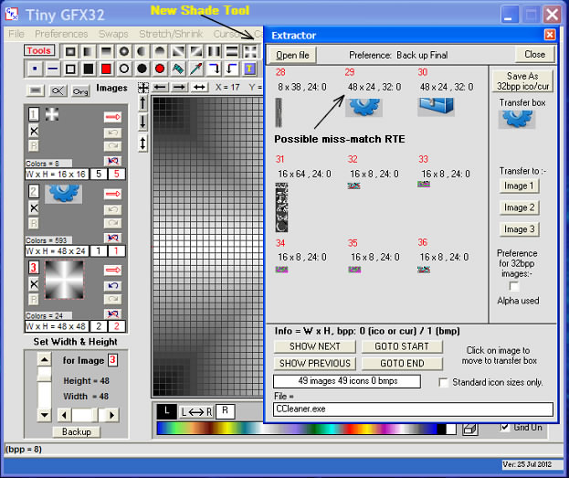



## Tiny GFX32 \(Update 25JUL2012\)

### Description

TinyGFX32 by Robert Rayment. (Update 25Jul2012.. 1. Avoid rare RTE for miss-match when Extracting some non-standard icons...2. Added new shade Tool. See TinyGFXUpdate.txt for other changes)....Program to make small bitmaps, icons and cursors - 1 x 1 to 64 x 64....

NOTE if the tinygfx.chm help file doesn't work with the program, open it on it's own, uncheck the security button and open.
 
### More Info
 
Pictures

Just run

             |
---                |---
**Submitted On**   |2012-07-25 08:18:30
**By**             |[Robert Rayment](https://github.com/Planet-Source-Code/PSCIndex/blob/master/ByAuthor/robert-rayment.md)
**Level**          |Intermediate
**User Rating**    |5.0 (357 globes from 72 users)
**Compatibility**  |VB 6\.0
**Category**       |[Complete Applications](https://github.com/Planet-Source-Code/PSCIndex/blob/master/ByCategory/complete-applications__1-27.md)
**World**          |[Visual Basic](https://github.com/Planet-Source-Code/PSCIndex/blob/master/ByWorld/visual-basic.md)
**Archive File**   |[Tiny\_GFX322226387252012\.zip](https://github.com/Planet-Source-Code/robert-rayment-tiny-gfx32-update-25jul2012__1-68524/archive/master.zip)

### API Declarations

A few when unavoidable

